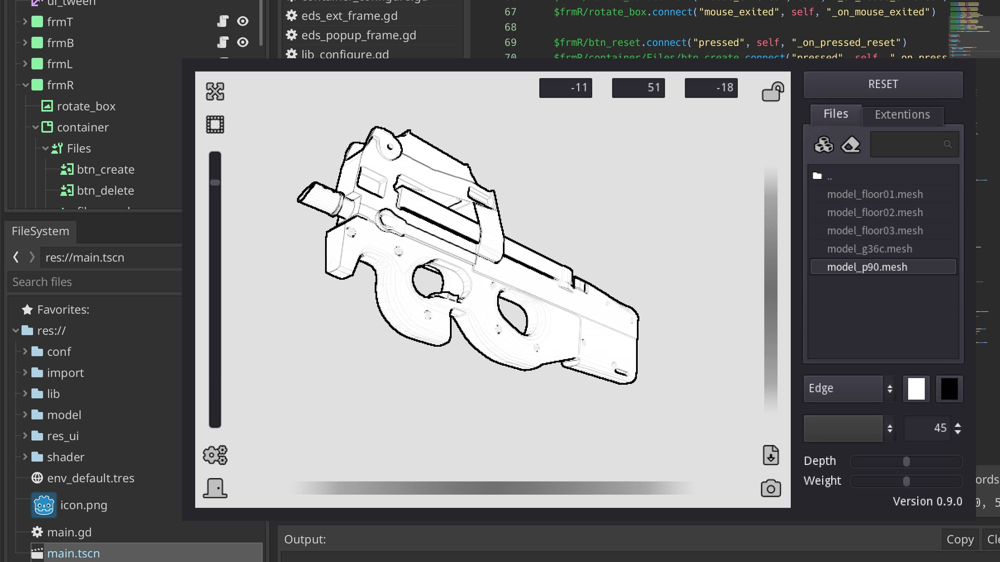
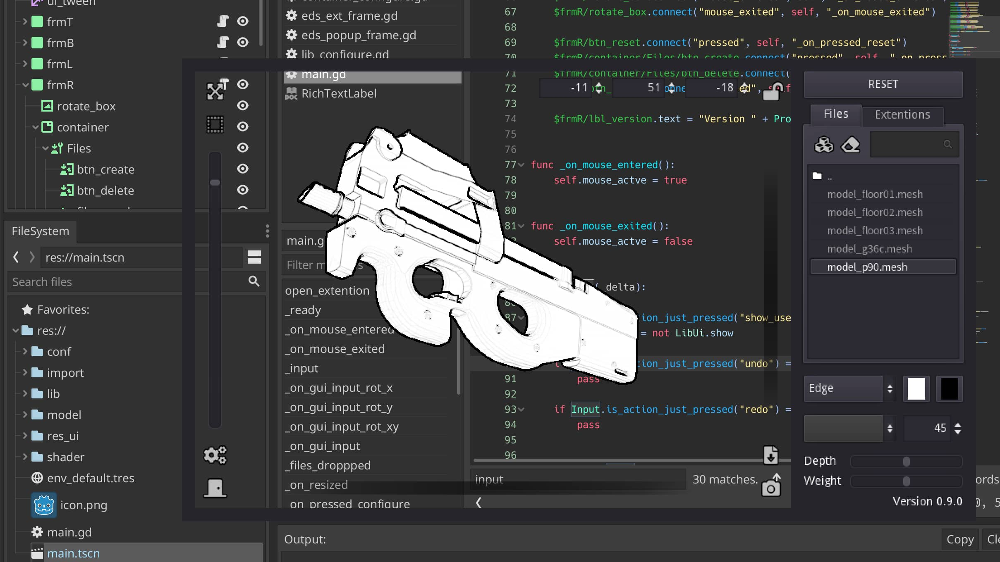
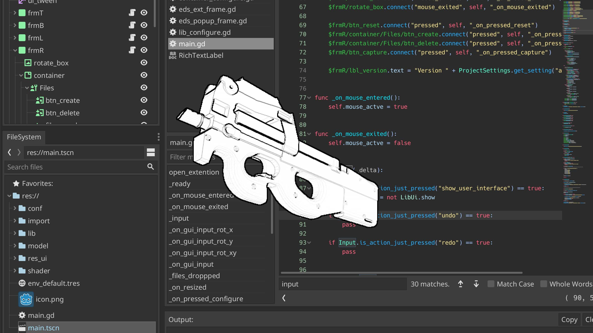
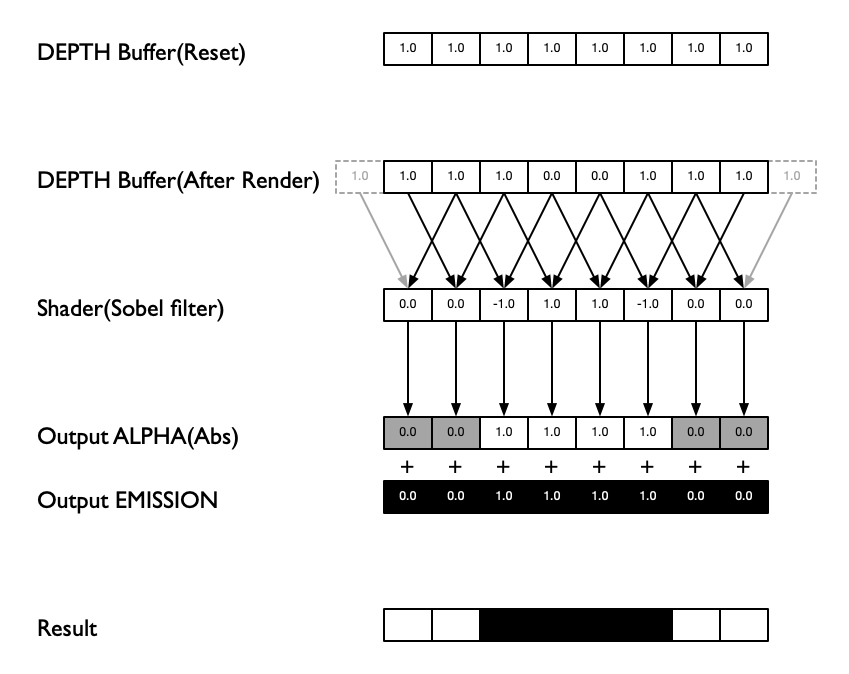

# Edge Detect Shader

## What's is this?

This application is used as a reference for layout when drawing manga and illustrations.

You can overlay the 3D model on the illustration you are drawing.

**Normal**


**Transparent Type1**


**Transparent Type2**



## Overview
This shader is implemented by referring to the following. 

* [Custom post-precessing(Godot Engine Document)][1]
* [Sobel operator(WIkipedia)][2]

The Sobel filter samples the surrounding information to determine its own information.
A two-dimensional image is used for sampling.
> For Godot Engine, you can use SCREEN_TEXTURE or DEPTH_TEXTURE.
> My implementation uses only DEPTH_TEXTURE.

### Technique

My implementation has been crafted to work with the depth buffer.

The depth buffer is expressed as 1.0 for the distance and 0.0 for the near.
Therefore, create an expression that makes the transparency of a flat place 0.0 when the Sobel filter is applied.

Specifically, it is the following part.
```
vec2 screen_unit = vec2(edge_size / screen_w, edge_size / screen_h);

float lin_depth = -8.0 * texture(DEPTH_TEXTURE, SCREEN_UV).r;

lin_depth += texture(DEPTH_TEXTURE, SCREEN_UV + vec2(0.0, screen_unit.y)).r;
lin_depth += texture(DEPTH_TEXTURE, SCREEN_UV + vec2(0.0, -screen_unit.y)).r;
lin_depth += texture(DEPTH_TEXTURE, SCREEN_UV + vec2(screen_unit.x, 0.0)).r;
lin_depth += texture(DEPTH_TEXTURE, SCREEN_UV + vec2(-screen_unit.x, 0.0)).r;
lin_depth += texture(DEPTH_TEXTURE, SCREEN_UV + screen_unit.xy).r;
lin_depth += texture(DEPTH_TEXTURE, SCREEN_UV - screen_unit.xy).r;
lin_depth += texture(DEPTH_TEXTURE, SCREEN_UV + vec2(-screen_unit.x, screen_unit.y)).r;
lin_depth += texture(DEPTH_TEXTURE, SCREEN_UV + vec2(screen_unit.x, -screen_unit.y)).r;
```

The reason for multiplying by -8.0 is that the Sobel filter samples the surrounding area eight times.

It's probably easier to understand if you think in 1D rather than 2D, so I'll show the figure below. In 2D, the number of surrounding samples is 8, but in 1D it is 2. 



[1]:https://docs.godotengine.org/en/stable/tutorials/viewports/custom_postprocessing.html
[2]:https://en.wikipedia.org/wiki/Sobel_operator

## Shaders

* Godot_sky_shader
  * https://github.com/Lexpartizan/Godot_sky_shader


## Models

The attached data is downloaded from 3D Warehouse.
These data are not outside the scope of this software license.

* model_G36 / G36
  * https://3dwarehouse.sketchup.com/model/b3460dcd945cb4598cb138e49a70d8bc/G36
* model_M14EBR / M14-EBR
  * https://3dwarehouse.sketchup.com/model/ca46c75c-df9e-4542-9e23-ce348c5de05f/M14-EBR
* model_MGL / Milkor-MGL-140-rocket-launcher3D
  * https://3dwarehouse.sketchup.com/model/e815bffc1dee0414f4aa69a000077765/Milkor-MGL-140-rocket-launcher3D
* model_P90.obj / Weapon-FN-P90
  * https://3dwarehouse.sketchup.com/model/1bd2fba303e04ce1283ffcfc40c29975/Weapon-FN-P90
* model_F16.obj / General-Dynamics-F-16-Fighting-Falcon
  * https://3dwarehouse.sketchup.com/model/e033b6ad34586a86cc1c9e8218bfe7fc/General-Dynamics-F-16-Fighting-Falcon
* model_JungleGym / Jungle-Gym
  * https://3dwarehouse.sketchup.com/model/03e019e9-e72b-4e00-8336-cddcc900b0d0/Jungle-Gym
* model_NewYork / New-York-20
  * https://3dwarehouse.sketchup.com/model/2e45457bae2e03589b95ac00cd4475a1/New-York-20